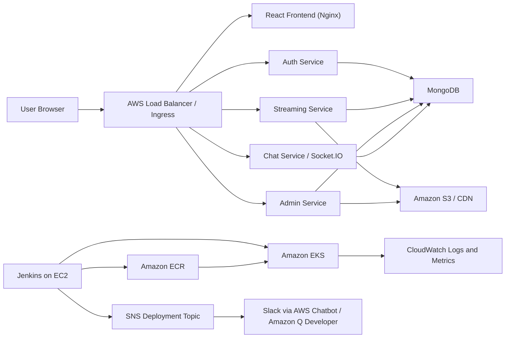

# StreamingApp Deployment with Kubernetes Orchestration and Auto Scaling

## About the Streaming App
Stream premium video content, host live watch parties, and manage your catalogue with a modern microservice architecture. The platform now ships with a production-ready admin portal, real-time chat, S3-backed adaptive streaming, and a redesigned cinematic frontend experience.

---

## Assignment Project Overview

This project demonstrates a complete end-to-end DevOps pipeline for a MERN (MongoDB, Express, React, Node.js) application, covering:

- Version Control with Git
- Containerization using Docker
- CI/CD with Jenkins
- Deployment on AWS EKS (Kubernetes)
- Monitoring & Logging with CloudWatch
- Optional ChatOps Integration

---

## Technology Stack

- Frontend: React
- Backend: Node.js, Express
- Database: MongoDB
- CI/CD: Jenkins
- Containerization: Docker
- Container Registry: Amazon ECR
- Orchestration: Kubernetes (EKS)
- Monitoring & Logging: AWS CloudWatch
- Cloud Provider: AWS

---

## Architecture


----

## Routing

The frontend image is built once and configured at runtime through `/env.js`.

In EKS, the ingress routes are:

- `/` -> frontend
- `/api/auth` -> auth
- `/api/streaming` -> streaming
- `/api/admin` -> admin
- `/api/chat` -> chat
- `/socket.io` -> chat websocket transport

----

## Runtime Configuration

Backend configuration is provided by a Helm ConfigMap and Secret. Frontend API URLs are runtime environment variables rendered by Nginx startup:

- `REACT_APP_AUTH_API_URL`
- `REACT_APP_STREAMING_API_URL`
- `REACT_APP_STREAMING_PUBLIC_URL`
- `REACT_APP_ADMIN_API_URL`
- `REACT_APP_CHAT_API_URL`
- `REACT_APP_CHAT_SOCKET_URL`

-----

## Scaling

- The Helm chart includes CPU-based `HorizontalPodAutoscalers` for the frontend and app services. 
- `MongoDB` is deployed as a single `StatefulSet` for assignment/demo use only.
- Used a managed database for production-grade availability.

----

# Deployment Steps

## Phase 1: Version Control with Git

### 🔹 1.1 Fork the Repository

- Go to the main repo: https://github.com/UnpredictablePrashant/StreamingApp/
- Click Fork

---

### 🔹 1.2 Clone Fork Locally

```bash
git clone https://github.com/Saima-Devops/StreamingApp.git
cd StreamingApp
```

---

### 🔹 1.3 Add Upstream (BEST PRACTICE)

This keeps the fork updated with the original repo.

```bash
git remote add upstream https://github.com/UnpredictablePrashant/StreamingApp.git
git remote -v
```

---

### 🔹 1.4 Sync Fork with Upstream

```bash
git fetch upstream
git checkout main # (if you are in other feature branch)
git merge upstream/main #if needed
git push origin main
```

> 💡 DevOps Tip: Do this regularly\
> Never work directly on main. Use feature branches.

---


## Phase 2: Prepare & Containerize MERN App

### Project Tech Stack:

- Frontend → React
- Backend → Node.js/Express
- Database → MongoDB (likely external or containerized)


---

### 🔹 2.1 Dockerfiles

**Inside /backend:**

There are 4 microservices:
   - adminService
   - authService
   - chatService
   - streamingService
     
> There must be separate Dockerfiles for each service with correct ports and endpoints.

-----

### Micro-Services Ports

| Service | Port | Description |
| --- | --- | --- |
| `authService` | 3001 | User authentication, registration, JWT issuance |
| `streamingService` | 3002 | Video catalogue, S3 playback endpoints, public APIs |
| `adminService` | 3003 | Dedicated admin microservice for asset management and uploads |
| `chatService` | 3004 | Websocket + REST chat for live watch parties |
| `frontend` | 3000 | React SPA with revamped UI and integrated chat |
| `mongo` | 27017 | Shared MongoDB instance |

> All backend services share common database models and utilities through `backend/common`.

------

### Containerization

The repository contains `Dockerfiles` for all components:

- `frontend/Dockerfile`
- `backend/authService/Dockerfile`
- `backend/streamingService/Dockerfile`
- `backend/adminService/Dockerfile`
- `backend/chatService/Dockerfile`

------

## 🔹 2.2 Environment Variables Configuration

Created an `.env` for each service. All services accept the standard AWS credentials for S3 access.

### Auth Service (`backend/authService/.env`)

```ini
PORT=3001
MONGO_URI=mongodb://localhost:27017/streamingapp
JWT_SECRET=changeme
CLIENT_URLS=http://localhost:3000
AWS_ACCESS_KEY_ID=
AWS_SECRET_ACCESS_KEY=
AWS_REGION=ap-south-1
AWS_S3_BUCKET=
```

> I have set up `.env` for each backend microservice, like the above, with my configurations & secrets with a specified port.

---

### 🔹 2.3 Frontend Dockerfile

**Inside /frontend:**

I have created `.env` with the following endpoints:

```ini
REACT_APP_AUTH_API_URL=http://localhost:3001/api
REACT_APP_STREAMING_API_URL=http://localhost:3002/api
REACT_APP_STREAMING_PUBLIC_URL=http://localhost:3002
REACT_APP_ADMIN_API_URL=http://localhost:3003/api/admin
REACT_APP_CHAT_API_URL=http://localhost:3004/api/chat
REACT_APP_CHAT_SOCKET_URL=http://localhost:3004
```

> Note: In frontend `localhost` can work, but in backend microservices, each should be communicated with the correct api so `localhost` will not work.

---

### 🔹 2.4 Test Locally with Docker

```bash
docker-compose up --build
```


<br>


<br>

`docker-compose` will build the images and run all the containers by reading each & every `Dockerfile` inside the app folder

------

**Access the App on port 3000/3005**

```bash
http://localhost:3000    # I mapped this on port 3005, because port 3000 was busy
```


<br>


<br>


<br>

<br>


---

## Troubleshooting:

### Frontend Errors

```
Browser → F12 key → Console
```

### Backend Errors

**Check backend logs**

```
docker-compose logs authservice
```

Check for:

❌ Mongo connection error\
❌ Port already in use\
❌ Missing env variables

---

### Port is already allocated (0.0.0.0:3000)

Solution:

**1. What is using port 3000**

```
lsof -i :3000
```

Copy the process id (PID) and kill that process if the process is not necessary.


**2. Kill the process**

```
kill -9 <pid>
```
---

### If it's an old container:

```
docker ps 
```

- Copy the container id or name

- Stop the container and delete:

```
docker stop <container_id>
docker rm <container_id>
```
---

Build again after all changes:

```
docker-compose down
docker-compose up --build
```

---

Each Microservice should use the following format to communicate with mongodb, localhost will not work

```
MONGO_URI=mongodb://mongo:27017/streamingapp
```

After fixing everything:

- Containers started ✔️
- Backend connected to Mongo ✔️
- Frontend loaded properly ✔️
- APIs responded ✔️

---

## ✅ Expected Results:


- Frontend → http://localhost:3000
- Auth API → http://localhost:3001
- Streaming API → http://localhost:3002


Local Testing Done! 👍


<br>

**Removed the Resources after local Testing:**


----

## ☁️ Phase 3: Install AWS CLI & Configure

```bash
aws configure
```

**Enter:**

- Access Key (Grab from AWS IAM User)
- Secret Key (Grab from AWS IAM User)
- Region (for eg: ap-south-1)

-----

### 🔹 3.1 Build, Tag and push Docker images to ECR using Jenkins jobs

I have written some clean shell scripts to push ALL services to AWS ECR, which will be executed through Jenkins Jibs.

- scripts/build-and-push-ecr.sh
- scripts/create-ecr-repos.sh
- scripts/deploy-eks.sh


### Make them executable

```
chmod +x build-and-push-ecr.sh
chmod +x create-ecr-repos.sh
chmod +x deploy-eks.sh
```
---


#### Every Changes were tested in staging branch before the final deployment


-----

## 🔧 PHASE 4: Jenkins CI/CD

### 🔹 4.1  Install Jenkins on EC2 or any cloud-based Jenkins

- Install Jenkins on an EC2 instance that has Docker, AWS CLI, kubectl, and Helm installed.
  
```
sudo apt update
sudo apt install openjdk-17-jdk -y
wget -q -O - https://pkg.jenkins.io/debian/jenkins.io.key | sudo apt-key add -
sudo apt install jenkins -y
```

---

### 🔹 4.2 Install Jenkins Plugins

- Pipeline
- Git
- GitHub
- AWS Credentials
- Docker Pipeline

**Verify:**

```
aws --version
docker --version
kubectl version --client
helm version
eksctl version
```

-----

### 🔹 4.3 Create Jenkins credentials:

- ID: aws-jenkins
- Type: AWS credentials
- Permissions: ECR push, EKS deploy, SNS publish if ChatOps is enabled

-----

### 🔹 4.4 Jenkins Pipeline

- Created a Pipeline job from SCM pointing to the repo "https://github.com/Saima-Devops/StreamingApp-Assignment-HV.git.
- Jenkinsfile is present on the root.
- Configured a webhook in your Git repository so new commits trigger builds.

**What does the pipeline do:**

- Checks out code.
- Logs in to ECR.
- Creates missing ECR repositories.
- Builds and pushes all five images.
- Deploys to EKS from main.
- Publishes optional SNS success/failure messages if SNS_TOPIC_ARN is set.

-------

### 🔹 4.5 Create AWS EKS Cluster

**Configure AWS locally:**
```
aws configure
export AWS_REGION=ap-south-1
export ECR_PREFIX=streamingapp
```


```
eksctl create cluster \
  --name streamingapp \
  --region "$AWS_REGION" \
  --nodes 2 \
  --node-type t2.medium \
  --managed
```

#### Configure kubectl

```
aws eks update-kubeconfig --name streamingapp --region "$AWS_REGION"
kubectl get nodes
```

**NOTE:** 
- Install the AWS Load Balancer Controller before using the default ALB ingress class. 
- Enable metrics-server if HPA scaling is desired.

------

### 🔹 4.6 Jenkins Pipeline (Build Now)


------

## 🏆 Finally, the Pipeline has been PASSED


After so much **Troubleshooting** got the cleanest CI/CD Pipeline finally:

<br>


------

### Common Pitfalls

❌ AccessDeniedException → IAM user missing ECR permissions\
❌ no basic auth credentials → forgot login step\
❌ repository not found → repo name mismatch\
❌ Depreciated Versions of dependencies, mismatch with the latest runtime


---

Now I have to deploy these images on Kubernetes (EKS) using Helm. Let's start!

---

## ☸️ PHASE 5: Deployment on Kubernetes (AWS EKS) with Helm

### 🔹 5.1 Create an EKS Cluster

```
eksctl create cluster \
  --streamingapp \
  --region ap-south-1 \
  --nodegroup-name streamingapp \
  --node-type t2.medium \
  --nodes 2
```


#### Verify Cluster Access

**Check nodes:**

```
kubectl get nodes
```

**This will:**

- Create EKS control plane
- Create worker nodes
- Configure networking
- Update kubeconfig automatically

-----

### 🔹 5.2 Create/Updat Helm Charts

```
helm upgrade --install streamingapp charts/streamingapp \
  --namespace streamingapp \
  --create-namespace \
  --set global.imageTag="$IMAGE_TAG" \
  --set services.frontend.image.repository="$ECR_REGISTRY/streamingapp/frontend" \
  --set services.auth.image.repository="$ECR_REGISTRY/streamingapp/auth" \
  --set services.streaming.image.repository="$ECR_REGISTRY/streamingapp/streaming" \
  --set services.admin.image.repository="$ECR_REGISTRY/streamingapp/admin" \
  --set services.chat.image.repository="$ECR_REGISTRY/streamingapp/chat" \
  --set secrets.jwtSecret="replace-with-a-strong-secret" \
  --set aws.region="$AWS_REGION" \
  --set aws.s3Bucket="sam-s3-bucket" \
  --set clientUrls=""
```

**Edit if needed:**

- values.yaml
- deployment.yaml
- service.yaml

> Check the names of ECR images. Verify all names and values are correct

```
helm repo update
kubectl get pods
```
<br>

#### Helm does:

- Install the applications on Kubernetes in few commands
- Manage releases
- Upgrade/rollback apps

> For the Infrastructure setup automation, we can use `Terraform`

----


----

### 🔹 5.2 S3 Storage


----

### 🔹 5.3 Check Rollout

```
kubectl get pods -n streamingapp
kubectl get ingress -n streamingapp
kubectl rollout status deployment/streamingapp-streamingapp-frontend -n streamingapp
```
-----


## 📊 PHASE 6: Monitoring & Logging

by **Amazon CloudWatch**

### Enable logging

Enable CloudWatch Container Insights or the Amazon CloudWatch Observability add-on for EKS:

- EKS → CloudWatch Logs
- EC2 → CloudWatch agent

```
aws eks create-addon \
  --cluster-name streamingapp \
  --addon-name amazon-cloudwatch-observability \
  --region "$AWS_REGION"
```

----

### Metrics

- CPU
- Memory
- Pod scaling

----

### Recommended alarms:

- ALB target 5xx count > 0 for 5 minutes
- Pod restart count > 3 in 10 minutes
- CPU > 70 percent for app deployments
- Memory > 80 percent for app deployments
- MongoDB PVC usage > 80 percent if using the demo in-cluster MongoDB


### Useful commands:
```
kubectl logs -n streamingapp deploy/streamingapp-streamingapp-auth
kubectl logs -n streamingapp deploy/streamingapp-streamingapp-streaming
kubectl logs -n streamingapp deploy/streamingapp-streamingapp-admin
kubectl logs -n streamingapp deploy/streamingapp-streamingapp-chat
```

**All Jenkins Jobs (CI/CD) are done successfully!!** 👍


----


## 🔔 PHASE 7: ChatOps

by **Amazon SNS (Simple Notification Service)**

Steps:
- Create SNS Topic
- Subscribe (Email / Slack Webhook)
- Trigger from Jenkins:

```
post {
    success {
      sh '''
        if [ -n "${SNS_TOPIC_ARN:-}" ]; then
          aws sns publish --topic-arn "$SNS_TOPIC_ARN" --message "Streaming app deployment succeeded: $JOB_NAME #$BUILD_NUMBER ($IMAGE_TAG)"
        fi
      '''
    }
    failure {
      sh '''
        if [ -n "${SNS_TOPIC_ARN:-}" ]; then
          aws sns publish --topic-arn "$SNS_TOPIC_ARN" --message "Streaming app deployment failed: $JOB_NAME #$BUILD_NUMBER"
        fi
      '''
    }
```

<br>

**Create an SNS topic:**

```
aws sns create-topic --name streamingapp-deployments --region "$AWS_REGION"
```


Set `SNS_TOPIC_ARN` in Jenkins. The included `Jenkinsfile` publishes deployment success/failure messages to that topic.

<br>

To send SNS messages to `Slack`, configure `AWS Chatbot` / Amazon Q Developer in chat applications:

---

### Slack Integration

**Steps:**

1. Connect your Slack workspace.
2. Create a channel configuration.
3. Attach the `streamingapp-deployments` SNS topic.
4. Allow the channel role to read CloudWatch/SNS notifications.


----

## ✅ PHASE 8: Final Validation

**After the ALB address is ready:**


----

**Also validate in the browser:**

- Register/login works.
- Browse page loads videos.
- Admin page can create/list videos.
- Chat connects on a video page.
- HPA objects exist with kubectl get hpa -n streamingapp.

----

### ⚠️ Reality Checks for Troubleshooting during the whole process

- Skipping Docker testing locally
- Wrong ECR tagging
- Jenkins permission issues
- EKS IAM misconfig
- Helm values are misconfigured


-----

## License

MIT © StreamFlix Team

-----

## Credits:

**Source Code:** UnpredictablePrashant/StreamingApp

**Demo Deployment:** by **Saima Usman**\
Student of PPMCAD-15

-----
