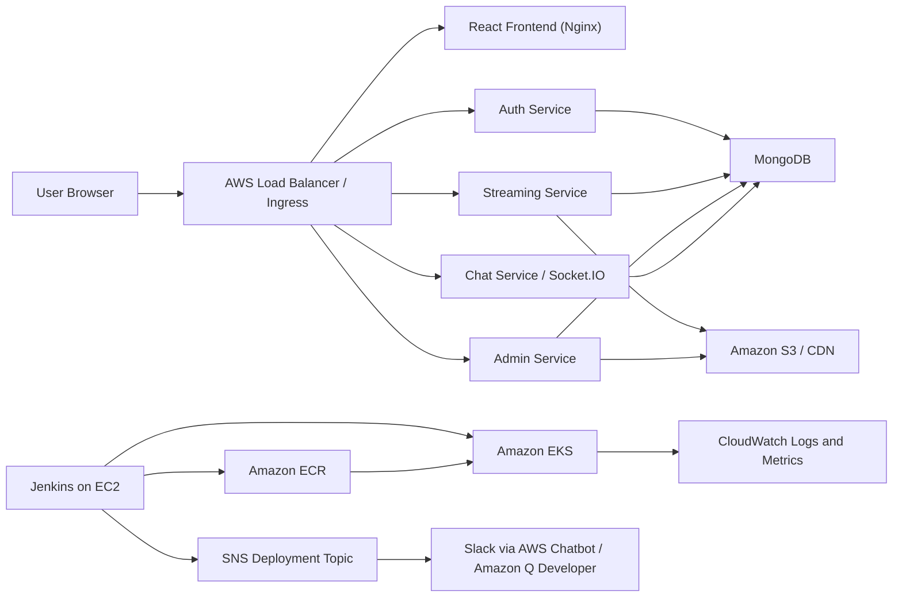

# Architecture

## Routing

The frontend image is built once and configured at runtime through `/env.js`.

In EKS, the ingress routes are:

- `/` -> frontend
- `/api/auth` -> auth
- `/api/streaming` -> streaming
- `/api/admin` -> admin
- `/api/chat` -> chat
- `/socket.io` -> chat websocket transport

## Runtime Configuration

Backend configuration is provided by a Helm ConfigMap and Secret. Frontend API URLs are runtime environment variables rendered by Nginx startup:

- `REACT_APP_AUTH_API_URL`
- `REACT_APP_STREAMING_API_URL`
- `REACT_APP_STREAMING_PUBLIC_URL`
- `REACT_APP_ADMIN_API_URL`
- `REACT_APP_CHAT_API_URL`
- `REACT_APP_CHAT_SOCKET_URL`

## Scaling

The Helm chart includes CPU-based HorizontalPodAutoscalers for the frontend and app services. MongoDB is deployed as a single StatefulSet for assignment/demo use only. Use a managed database for production-grade availability.
